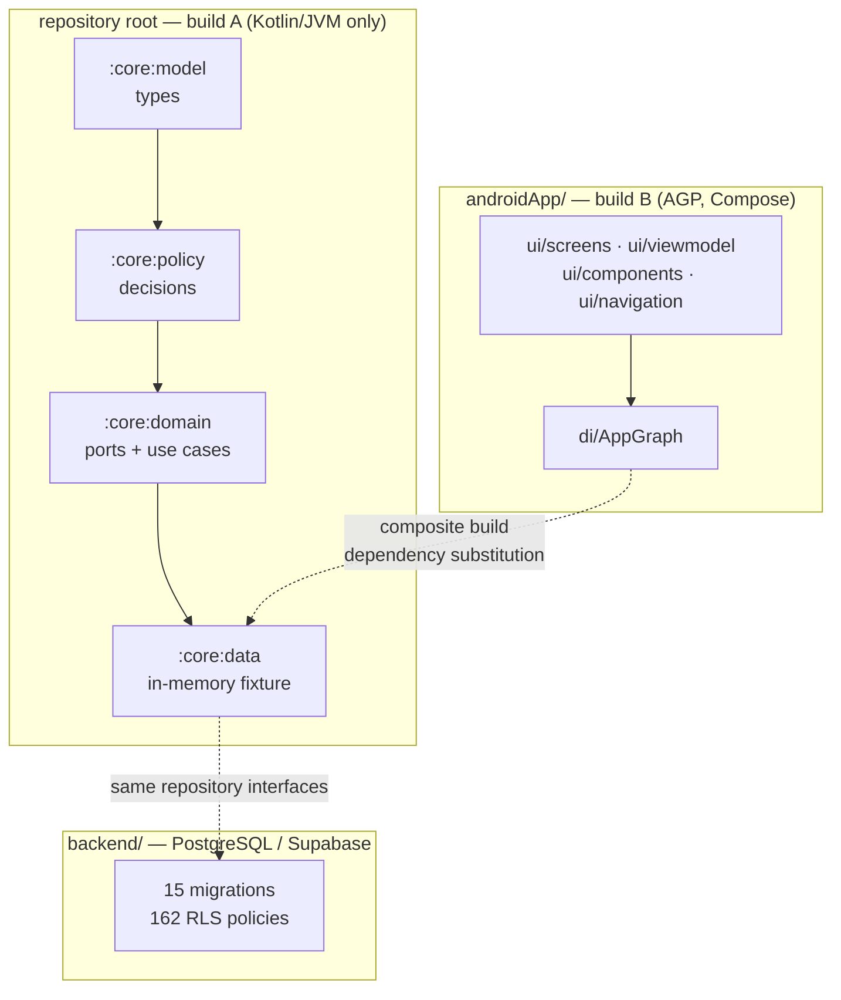
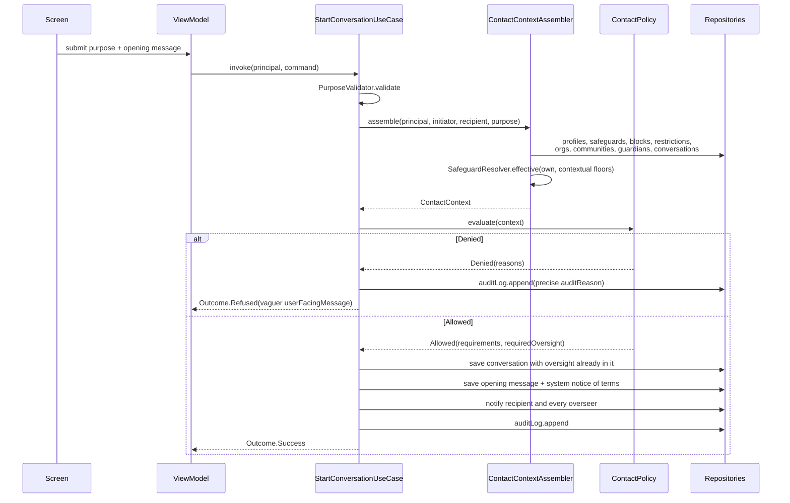

# Architecture

## The shape of it in one paragraph

There are two Gradle builds. The repository root is a pure Kotlin/JVM build containing four
modules — `:core:model`, `:core:policy`, `:core:domain`, `:core:data` — with no Android
dependency and no Google Maven repository declared anywhere. `androidApp/` is a separate
Gradle build that includes the root as a composite build and substitutes the
`org.fisabilillah:core-*` coordinates for the sibling projects. The database lives in
`backend/` as a set of PostgreSQL migrations and row-level security policies, and is not
part of either Gradle build.



## Why the split exists

Three reasons, in order of how much they matter.

**The safety-critical logic must be cheap to verify.** Everything that decides whether one
person may contact another lives in `:core:policy` and `:core:domain`. Because those modules
depend on nothing but `kotlinx-datetime`, `kotlinx-serialization` and `kotlinx-coroutines`,
their tests run on any machine with a JDK — in CI, on a laptop with no Android tooling
installed, and inside restricted build environments where `dl.google.com` is unreachable.
The `core` job in `.github/workflows/ci.yml` needs no SDK, no emulator and no Google Maven
access, and says so in a comment.

**The same core can back a future iOS client.** Nothing in `core/` imports an Android type.
Converting these modules to Kotlin Multiplatform is a matter of changing the plugin and
moving sources to `commonMain`; see [`native-roadmap.md`](native-roadmap.md) for the one
genuine JVM dependency that has to be abstracted first.

**It makes accidental coupling loud.** A screen that wanted to make a safety decision itself
would have to add that decision to a module the Android build does not own. The compiler
does not enforce this, but the module boundary makes the wrong thing visible in review.

The practical consequence, stated plainly because it costs people an afternoon otherwise:
**open `androidApp/` in Android Studio, not the repository root.** The root is a plain
Kotlin/JVM project and the IDE will not offer you a run configuration, an emulator, or a
Compose preview if you open it.

## The four core modules

### `:core:model` — types

`core/model/src/main/kotlin/org/fisabilillah/core/model/`

Data classes and enums with no behaviour beyond derived properties and `init` validation.
Fourteen files, grouped by area: `Ids`, `Common`, `Roles`, `Profile`, `Safeguards`,
`Messaging`, `Serving`, `Learning`, `Requests`, `Organizations`, `Wali`, `Moderation`,
`Trust`, `Giving`, `Governance`.

Two conventions carry real weight here:

- **Typed identifiers.** Every entity has its own `@JvmInline value class` identifier, so a
  `UserId` cannot be passed where an `OrganizationId` is expected. On a platform where a
  mix-up means showing one person's private records to another, the compiler is the cheapest
  reviewer available.
- **Strictness ordering.** `AudienceScope`, `LocationPrecision`, `NameVisibility`,
  `ModeratorPresenceRule` and `CrossGenderConversationStructure` each carry a numeric
  `strictness` and a `stricter(a, b)` companion function. This is what lets two settings be
  combined by taking the stricter one, which is the single rule the whole safeguard system
  rests on.

Depends on: `kotlinx-datetime`, `kotlinx-serialization-json`.

### `:core:policy` — decisions

`core/policy/src/main/kotlin/org/fisabilillah/core/policy/`

Pure functions and stateless objects. No I/O, no coroutines, no repositories. Everything a
decision needs arrives as a parameter, which is what makes exhaustive testing possible.

| Object | Decides |
| --- | --- |
| `SafeguardResolver` | The rules actually in force once organisation and community floors are applied |
| `SafeguardPresets` | The five named starting points plus `CUSTOM` |
| `ContactPolicy` | Whether one member may open a conversation with another, and who must be in it |
| `PurposeValidator` | Whether a stated purpose is a real request rather than an opening line |
| `IntroductionPolicy` | The whole guardian-led introduction workflow, including its state machine |
| `VisibilityPolicy` | What one member is allowed to see of another |
| `TrustPolicy` | The handful of public labels derived from private behaviour |
| `ModerationPolicy` | Triage, escalation, moderator authority, appeals, unsend, report-pattern assessment |
| `VerificationPolicy` | What a member may and may not assert about themselves |
| `ContentSignals` | Advisory, explainable checks on message text |

Depends on: `:core:model` only.

### `:core:domain` — ports and use cases

`core/domain/src/main/kotlin/org/fisabilillah/core/domain/`

`Repositories.kt` declares the ports — around twenty interfaces, written so that a Supabase
client, a Room database or the in-memory fixture can all satisfy them without a use case
changing. None of them takes a "current user" for authorisation purposes: authorisation is
decided in the use case against a `Principal` and enforced again in the database by
row-level security. A repository is a store, not a gatekeeper.

The use cases are the only things that write state. Each one is a class with an
`operator fun invoke`, constructed with its collaborators. `Outcome<T>` is the return type —
deliberately not `Result`, because a refusal here ("this member does not accept messages
from strangers") is an ordinary expected answer rather than an exception, and modelling it
as a failure would make calling code treat it as a bug.

`ContactContextAssembler` sits between the two: it touches nine repositories to gather the
facts `ContactPolicy.evaluate` needs, and keeping that assembly away from the decision is
what allows the decision to be tested without a database.

Depends on: `:core:model`, `:core:policy`, `kotlinx-coroutines-core`.

### `:core:data` — development fixture

`core/data/src/main/kotlin/org/fisabilillah/core/data/`

Three files:

- `InMemoryRepositories.kt` — a single `InMemoryStore` of mutable maps and lists guarded by a
  `Mutex`, plus an implementation of every repository interface. A `revision` `StateFlow` is
  bumped on each write so the observable flows re-emit.
- `SeedData.kt` — the sample community. Entirely invented: reserved phone ranges, `.test`
  email domains, made-up addresses. The scenarios are chosen to exercise what is easy to get
  wrong: an organisation whose floor is stricter than its members chose, a youth programme
  requiring background checks, a request whose address stays hidden, a campaign that cannot
  take money, and an introduction sitting with a wali.
- `Runtime.kt` — `SystemClock`, `FixedClock`, `SequentialIdGenerator`, `UuidIdGenerator`, the
  three store-backed resolvers, and `CoreGraph`, the hand-wired composition root that
  constructs every repository and every use case.

**This is a fixture, not a database.** Nothing survives a process restart.

Depends on: `:core:domain`.

## The Android build

`androidApp/settings.gradle.kts` declares the composite build and the substitutions:

```kotlin
includeBuild("..") {
    dependencySubstitution {
        substitute(module("org.fisabilillah:core-model")).using(project(":core:model"))
        substitute(module("org.fisabilillah:core-policy")).using(project(":core:policy"))
        substitute(module("org.fisabilillah:core-domain")).using(project(":core:domain"))
        substitute(module("org.fisabilillah:core-data")).using(project(":core:data"))
    }
}
```

`androidApp/app/build.gradle.kts` then depends on those coordinates as if they were
published artifacts. They are not: Gradle resolves them to the sibling build's projects, so
editing `core/policy` and rebuilding the app picks the change up with nothing published.

Both builds read the same version catalogue, `gradle/libs.versions.toml`, via
`from(files("../gradle/libs.versions.toml"))`. The Android entries in that catalogue —
AGP 8.7.3, the Compose BOM, AndroidX — are only ever resolved by the `androidApp` build,
because the root's `settings.gradle.kts` declares `mavenCentral()` and nothing else.

Both builds target JVM 17 bytecode. The root sets it in `build.gradle.kts` via a
`subprojects` block, so the modules stay consumable by the Android module regardless of
which JDK the build itself runs on.

### Inside the app

```
androidApp/app/src/main/java/org/fisabilillah/app/
├── FiSabilillahApplication.kt   holds the AppGraph
├── MainActivity.kt              theme, scaffold, bottom bar, nav host
├── di/AppGraph.kt               composition root + SessionManager + view-model factories
└── ui/
    ├── theme/                   Color, Type, Theme (Material 3, plus a spacing scale)
    ├── components/Components.kt the shared component vocabulary
    ├── navigation/Routes.kt     every destination, and the six primary ones
    ├── viewmodel/ViewModels.kt  seventeen view models, one per screen area
    └── screens/                 onboarding · home · serve · learn · requests · messages
                                 projects · community · profile · safety · moderation · legal
```

Two design decisions in the UI layer are worth stating.

**Screens are assembled from `Components.kt`, not from raw Material components.** The
obvious reason is consistency. The less obvious one is that several of those components —
`SafeguardBanner`, `PrivacyNote`, `DisclaimerCard`, `VerificationBadge` — carry safety
meaning, and centralising them means a screen cannot show a verification mark without also
showing what that mark does not prove.

**The bottom bar has six destinations, all of them a thing to do rather than a thing to look
at.** There is no "discover" or "explore" tab. A tab bar is the strongest statement a mobile
app makes about what it is for, and browsing people is not an activity this product wants to
make easy.

## Where a request goes

Opening a conversation, as an example of the whole path:



Two things about that diagram are load-bearing.

Oversight participants — a guardian, a moderator, a third party, an organisation
representative — are members of the thread **at creation**, before the first message is
readable. They are not invited afterwards, not optional, and `AddOversightUseCase` has no
corresponding remove, because a person who can be removed from a thread by the person they
are supervising is not oversight.

The refused branch writes an audit entry even though nothing was created. A pattern of
refused approaches to the same person is visible to the safety team even though the
recipient never saw a single one of them.

## The database layer

Not part of either Gradle build. `backend/supabase/migrations/` holds fifteen migrations
applied in filename order; `0013_row_level_security.sql` enables RLS on all 58 tables and
ends with an assertion that fails the migration if any table in `public` has it off.

The relationship to the core is that the same invariants are enforced twice, independently:
once in `:core:policy` against a `Principal`, and once in the database against `auth.uid()`.
Neither is a substitute for the other. A bug in a use case is caught by row-level security;
a client that talks to PostgREST directly still meets the policies.

Read, in this order:

- [`backend/docs/data-model.md`](../backend/docs/data-model.md) — tables, enums, helper functions
- [`backend/docs/rls-model.md`](../backend/docs/rls-model.md) — who may do what to every table
- [`backend/docs/threat-model.md`](../backend/docs/threat-model.md) — attack paths and residual risk

Several core concepts have a direct counterpart in the schema, and it is worth knowing which:

| Core concept | Schema counterpart |
| --- | --- |
| `TrustedContact.privateContact` | `wali_profiles.contact_email` / `.contact_phone`, with SELECT revoked from every application role including moderators; disclosure only through `app.get_wali_contact()` and written to an append-only ledger |
| `ServiceRequest.place.exact` | `service_request_private_details`, readable by the requester, the accepted helper, and moderators |
| `MessageRedaction` | `message_redactions`, moderator-only and append-only |
| `AuditLogEntry` | `audit_logs`, no UPDATE or DELETE policy and the privilege revoked |
| `DonationFeatureFlags.paymentsEnabled` | `check (payments_enabled = false)` on campaigns |

## What is deliberately absent from the architecture

- **No dependency-injection framework.** `CoreGraph` and `AppGraph` are hand-wired. With
  this many collaborators a graph you can read top to bottom is worth more than the lines a
  framework would save, and it keeps the core free of annotation processing — which matters
  when the same code has to be consumable from a plain JVM test and, later, from iOS.
- **No image loading library.** Consequently `InitialsAvatar` is the default representation
  of a person everywhere. This is currently a limitation, not a principle, but the fallback
  it forces happens to match the product's position on photographs.
- **No analytics SDK, no crash reporter, no attribution library.** Adding one is a privacy
  decision, not a tooling decision; see [`privacy-model.md`](privacy-model.md).
- **No recommendation engine.** `HomeDigestUseCase` filters by what the member said they can
  do and where they are. It does not learn from what they tap.

## Honest limitations

Repeated here so that nobody reads this document alone and forms the wrong impression:

- The Android module **compiles but has never been run**. CI assembles a debug APK; no test
  and no person has opened a screen. See the status section of the
  [root README](../README.md).
- The app's **content** is backed by the in-memory fixture, not the schema in `backend/`.
  Authentication is the exception: it reaches the live Supabase project.
- **Authentication has never completed a live round trip from Kotlin.** `core:auth` is
  tested against a fake transport; the build environment cannot reach `*.supabase.co`.
- **Payments are off** behind `DonationFeatureFlags.paymentsEnabled = false`.
- **Screen copy is inline** in the Compose sources rather than in `strings.xml`.
