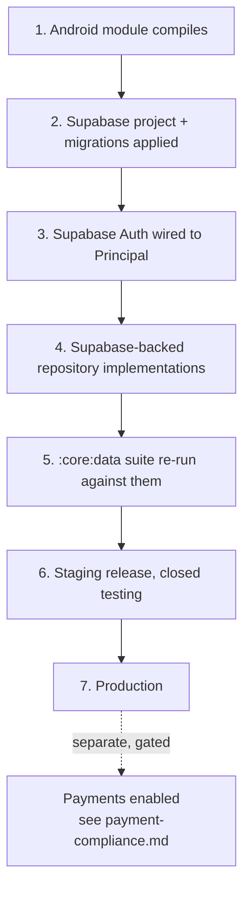

# Deployment

## Status

**Nothing has been deployed.** There is no staging environment, no production project, no
signed release build, and no store listing. This document describes what deployment will
involve and what has to be true before it happens, based on what is actually in the
repository.

Three things have to be understood before reading further:

- The Android module **compiles but has never been run**. CI assembles a debug APK on every
  push. A release build is not the next step; running the debug one is.
- The app's content is backed by the **in-memory fixture** in `core:data`, not by the schema
  in `backend/`. There are no Supabase-backed repository implementations yet.
- **Authentication is real** — GoTrue, against the live project, with tokens held under the
  Android keystore — but it has never completed a live round trip from this repository,
  because the build environment cannot reach `*.supabase.co`.

Deploying the current state would ship an application whose accounts are real and whose
content vanishes on restart. Do not.

---

## The order of work



Steps 1 to 5 are engineering. Step 6 onwards involves obligations that are not engineering
at all, and the payments branch is gated on a compliance checklist that has not been
started.

---

## 1. The database

The schema is the only part of the system that is genuinely deployable today.

```console
$ supabase db push                                        # applies supabase/migrations in order
$ psql "$SUPABASE_DB_URL" -f backend/supabase/seed/seed.sql   # non-production only
```

Fifteen migrations, applied in filename order, `0001` through `0015`. They are additive and
ordered; there are no down-migrations. `0013_row_level_security.sql` ends with an assertion
that fails the migration if any table in `public` has RLS off, so a schema change that
forgets a policy cannot be applied.

**Never apply `backend/supabase/tests/00_bootstrap.sql` to a Supabase project.** It exists
solely to recreate, on a plain PostgreSQL cluster, what Supabase already provides: the `auth`
schema, `auth.users`, `auth.uid()`, `auth.role()` and the `anon` / `authenticated` /
`service_role` roles. The migrations contain no part of it, which is what makes them
portable.

The migrations assume the migration role can create schemas, extensions and grants
(Supabase's `postgres` role can, and has `BYPASSRLS`, which is what lets the
`security definer` helpers read past policies), and that `auth.uid()` returns the requesting
user's id.

### Storage buckets

Object *paths* are stored as plain text (`avatar_path`, `evidence_path`,
`attachment_path`) — never public URLs. Bucket policies are configured separately in the
Supabase dashboard and must mirror the RLS rules in
[`backend/docs/rls-model.md`](../backend/docs/rls-model.md). Getting this wrong is the
easiest way to undo the whole privacy model: a public bucket makes every evidence file and
every profile photograph readable by URL regardless of what the row policies say.

Before any environment holds real data:

- [ ] Every bucket is private; no anonymous read.
- [ ] Evidence objects are readable only through a signed URL minted by a `security definer`
      path that checks moderator membership.
- [ ] Avatar objects respect `UserSafeguards.profileImageVisibleTo`.
- [ ] Uploads are size-capped and content-type-checked.
- [ ] A malware scan runs on upload — see the placeholder in `.env.example`; **this is not
      wired up.**

### Migration hygiene

- [ ] `run_local_tests.sh` passes locally before a push.
- [ ] The CI `database` job is green.
- [ ] Every new invariant has an assertion in `backend/supabase/tests/rls_tests.sql`, paired
      with a positive control.
- [ ] A backup and a tested restore exist before the first migration against an environment
      holding real data.

---

## 2. Secrets and configuration

Copy `.env.example` and fill it in. Nothing in the repository reads it yet; it documents the
variable names the production path will need.

The one that matters:

**`SUPABASE_SERVICE_ROLE_KEY` bypasses row-level security entirely.** It must never be
embedded in an Android build, never appear in a client-side configuration file, never be
committed, and never be pasted into an issue or a log. Every guarantee described in
[`safeguards.md`](safeguards.md), [`privacy-model.md`](privacy-model.md) and
[`wali-workflow.md`](wali-workflow.md) is enforced by RLS, and that key turns all of it off.
`backend/docs/threat-model.md` treats its compromise as a distinct attack path (AP-13).

Checklist before any environment is created:

- [ ] Secrets live in a managed store, not in a `.env` file on someone's laptop.
- [ ] The service-role key is held by CI and server-side jobs only, and is rotatable.
- [ ] A rotation procedure exists and has been rehearsed.
- [ ] `.env` is in `.gitignore` (it is) and no key has ever been committed — verify with a
      history scan, not by looking at the current tree.
- [ ] Anything an Android build embeds is treated as public, because an APK is not a secret.

---

## 3. Authentication

Wired up. `SessionManager` in `androidApp/app/src/main/java/org/fisabilillah/app/di/AppGraph.kt`
wraps `MemberSession` from `:core:auth`, which talks to Supabase Auth (GoTrue) and derives
the `Principal` from `public.current_member()` — a `SECURITY DEFINER` function reading the
profile row for `auth.uid()`. The refresh token is held under the Android keystore, AES-256-GCM.
Full description in [`authentication.md`](authentication.md).

The property that must survive any change here: the `Principal` is derived from stored
account state, never from anything a screen passes in. A view model that wanted to act as
somebody else would have to change `SessionManager`, which is a reviewable act rather than
an accident. Keep it that way.

Done:

- [x] Sessions come from Supabase Auth; the seeded-account picker is deleted, not hidden.
- [x] Roles are read server-side from the profile row, never from a client claim.
- [x] `VerificationPolicy.sanitizeRoleRequest` still runs on every profile write, and
      `trg_profiles_guard_identity` rejects a self-assigned privileged role independently —
      on INSERT as well as UPDATE.
- [x] Account recovery does not leak whether an address is registered: an unknown address
      and a known one produce the same screen, and sign-up for an existing address returns
      the same "check your email" outcome as a new one.

Before release:

- [ ] **A live round trip has actually been observed.** Nothing in this repository has
      reached `*.supabase.co` — the build environment blocks it — so sign-up, sign-in and
      refresh are proven only against a fake transport and by SQL on the server side.
- [ ] A new-device sign-in produces a `LOGIN_FROM_NEW_DEVICE` audit entry and a
      `NEW_DEVICE_LOGIN` notification, both of which already exist in the model.
- [ ] Email confirmation redirect URLs are configured on the project for the release
      package, not just for development.

---

## 4. The Android release

`androidApp/app/build.gradle.kts` today: `applicationId` `org.fisabilillah.app`,
`versionCode` 1, `versionName` 0.1.0, `minSdk` 26, `targetSdk` 35, debug builds suffixed
`.debug`, release builds with `isMinifyEnabled` and `isShrinkResources` on and
`proguard-rules.pro` applied.

There is no signing configuration, and there should not be one in the repository.

- [ ] `assembleDebug` succeeds. **This has never happened.**
- [ ] `testDebugUnitTest` succeeds and there is at least one meaningful test.
- [ ] R8 does not strip something the app needs — verify `proguard-rules.pro` against the
      release build, not the debug one.
- [ ] An upload key exists in a managed store, and Play App Signing is enabled.
- [ ] Screen copy has been extracted to `strings.xml` if any locale other than English is
      intended. Today it is inline in the Compose sources.
- [ ] The data-safety declaration matches [`privacy-model.md`](privacy-model.md) exactly.
- [ ] The store listing does not describe the introduction feature in dating terms, because
      it is not one and describing it that way would attract exactly the wrong users.

### Play policy exposure

Two areas need attention beyond the ordinary:

**User-generated content.** The listing must state that there is in-app reporting, in-app
blocking, and a published moderation standard. All three exist:
`SubmitReportUseCase`, `BlockUserUseCase`, and [`moderation-guide.md`](moderation-guide.md).

**The introduction workflow.** It is a guardian-mediated family process with no browsing, no
matching and no ranking. Describing it accurately is both honest and the correct policy
position; describing it as dating would be neither.

---

## 5. Before a single real member joins

These are not engineering tasks, and they cannot be done afterwards.

- [ ] A named data controller and a published privacy notice consistent with
      [`privacy-model.md`](privacy-model.md).
- [ ] A trained safety team large enough to meet the triage targets in
      [`moderation-guide.md`](moderation-guide.md) — `IMMEDIATE` for critical categories is a
      staffing commitment, not a constant.
- [ ] An escalation route to law enforcement and to child-protection authorities, and a
      named person who owns it. `EscalationLevel.EXTERNAL_REFERRAL` exists in the model; the
      human process behind it does not.
- [ ] A retention schedule, implemented, matching what the privacy notice says.
- [ ] A data-subject access and deletion procedure that a person can actually invoke.
- [ ] An incident-response plan covering a data breach.
- [ ] Identity verification through a real provider. `VerificationLevel.IDENTITY_VERIFIED`
      currently means nothing is checked at all — the provider placeholder in `.env.example`
      is not wired up, and a badge that overstates what was checked is worse than no badge.
- [ ] Background checks through a real provider for the categories where
      `ServiceCategory.requiresBackgroundCheckByDefault` is true. See
      [`child-safety.md`](child-safety.md).

---

## 6. Payments

Separate, and gated per campaign.

Stripe is wired up. The mechanism is in [`payments.md`](payments.md); the obligations are in
[`payment-compliance.md`](payment-compliance.md), and building the mechanism discharges none
of them.

What is deployed:

- `donation-checkout` and `stripe-webhook`, two Supabase edge functions. The Stripe key
  lives in the first; the second is the only thing in the system that can mark a donation
  as settled, and it does so only on an event whose HMAC signature it has verified.
- Migration `0019_stripe_payments.sql`, which takes INSERT, UPDATE and DELETE on
  `donations` away from every client role. Before it, a member could insert a donation for
  any amount and update their own row — harmless for a note about offline giving, and not
  harmless once a campaign total is derived from it.

What is not done, and blocks any real donation:

- [ ] `STRIPE_SECRET_KEY`, `STRIPE_WEBHOOK_SECRET` and `DONATION_RETURN_URL` set as
      function secrets. Until they are, `donation-checkout` returns 503 and no donation can
      be created — the intended unconfigured state.
- [ ] A webhook endpoint created in Stripe pointing at the deployed function, subscribed to
      the five events listed in [`payments.md`](payments.md).
- [ ] At least one organisation verification and one campaign `financial_review` recorded,
      because `campaign_may_collect()` returns false for every campaign until both exist.
- [ ] **A test-mode donation taken end to end.** Nothing in this repository has ever reached
      Stripe. The signature check has been tested against the algorithm it implements, never
      against a real Stripe signature.
- [ ] The compliance checklist. Registration, tax treatment, KYB, sanctions screening and a
      published refund policy. The code enforces that somebody verified a campaign; it
      cannot enforce that the verification meant anything.

Recurring giving remains off, and `Campaign.init` throws if `allowsRecurring` is set.

---

## Rollback

- **Database:** there are no down-migrations. Recovery is restore-from-backup, so a tested
  restore has to exist before the first migration against real data. A migration that adds a
  policy can be reversed by a new migration that drops it; a migration that drops a column
  cannot.
- **Android:** Play staged rollout, halted and rolled back to the previous version code.
  Assume some users are on the bad build until they update.
- **Payments:** the kill switch is per campaign and is a database write — set
  `payments_enabled` to false, which a platform administrator can do at any time and which
  takes effect on the next attempt. Revoking the organisation's verification stops every
  campaign it runs, in the same way. Neither needs a release.
- **Other feature flags:** `DonationFeatureFlags.recurringEnabled` is a compile-time
  constant. If a runtime kill switch is needed for anything else, it does not exist yet and
  must be designed rather than improvised.

---

## Monitoring

Nothing is instrumented. When something is added, two constraints apply:

- **Message bodies must not leave the device except as evidence attached to a report.**
  `ContentSignals` runs on-device precisely so that nothing is transmitted to produce a
  flag, and `ContentSignals.DISCLOSURE` promises members exactly that. An error reporter
  that captures a Compose state tree containing message text would break that promise.
- **Audit logs are not analytics.** `AuditLogEntry` is an accountability record. Do not pipe
  it into a product-metrics tool where it becomes a dataset about members' behaviour.

What is worth watching, when there is somewhere to watch it: refusal rates by
`DenialReason.auditReason` (a spike in `VERIFICATION_TOO_LOW` means onboarding is
mis-setting expectations), time-to-triage against the targets in
[`moderation-guide.md`](moderation-guide.md), appeal-upheld rate as a signal about
moderation quality, and `GUARDIAN_CONTACT_ACCESSED` volume, which should be very low and
should have a named reason every time.
