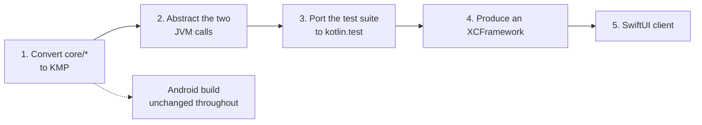

# Native roadmap: adding an iOS client

## The starting position is better than usual

The four `core` modules already have no Android dependency. That was not a happy accident; it
is the reason the repository is split into two Gradle builds at all, and the root
`settings.gradle.kts` says so in a comment: *"so the same core can later be consumed by an
iOS/Kotlin Multiplatform client or a server-side tool."*

Concretely, an audit of every main source file under `core/` for JVM-only API turns up
**exactly two lines**, both in one file:

```
core/data/src/main/kotlin/org/fisabilillah/core/data/Runtime.kt:54   import java.util.concurrent.atomic.AtomicLong
core/data/src/main/kotlin/org/fisabilillah/core/data/Runtime.kt:104  java.util.UUID.randomUUID().toString()
```

Nothing else. No `java.time`, no `java.util.Collections`, no platform reflection, no
`ThreadLocal`, no file or network access of any kind.

Everything the core depends on is already multiplatform:

| Dependency | Multiplatform |
| --- | --- |
| `kotlinx-datetime` 0.6.1 | yes — `Instant`, `LocalTime`, `TimeZone`, `DayOfWeek`, `Clock.System` all work on Apple targets |
| `kotlinx-serialization-json` 1.7.3 | yes |
| `kotlinx-coroutines-core` 1.9.0 | yes, including `Flow`, `StateFlow` and `Mutex` |
| `kotlin.text.Regex` | yes — used in `ContentSignals` and nowhere else |
| `@JvmInline value class` | yes — the annotation is available in common code and ignored off the JVM |

The two policy modules that matter most, `:core:policy` and `:core:domain`, contain no
platform API at all. `ContactPolicy`, `IntroductionPolicy`, `SafeguardResolver`,
`VisibilityPolicy`, `ModerationPolicy`, `VerificationPolicy`, `PurposeValidator` and
`ContentSignals` would compile for an Apple target unchanged today.

---

## What the work actually is



The Android build is unaffected at every step. Converting a Kotlin/JVM module to a
multiplatform module with a `jvm()` target produces the same artifact for the same
coordinates, and `androidApp/settings.gradle.kts` keeps substituting them.

---

## Step 1 — convert `core/*` to Kotlin Multiplatform

Four modules, each of which becomes:

```kotlin
plugins {
    alias(libs.plugins.kotlin.multiplatform)   // replaces kotlin.jvm
    alias(libs.plugins.kotlin.serialization)   // :core:model only
}

kotlin {
    jvm()
    iosArm64()
    iosSimulatorArm64()

    sourceSets {
        commonMain.dependencies { /* the existing dependencies */ }
        commonTest.dependencies { implementation(kotlin("test")) }
    }
}
```

Sources move from `src/main/kotlin/` to `src/commonMain/kotlin/`. That is the whole of the
mechanical work for `:core:model`, `:core:policy` and `:core:domain` — no source file needs
editing.

The JVM target must keep producing what the Android build consumes: `jvmTarget` 17, and the
same `group` and `version` so the substitution in `androidApp/settings.gradle.kts` continues
to resolve.

Add `kotlin-multiplatform` to `gradle/libs.versions.toml` alongside the existing
`kotlin-jvm` plugin alias.

---

## Step 2 — abstract the two JVM calls

Both are in `core/data/.../Runtime.kt`, and both are identifier generation.

### `UuidIdGenerator`

```kotlin
public class UuidIdGenerator : IdGenerator {
    override fun newId(): String = java.util.UUID.randomUUID().toString()
}
```

`IdGenerator` is already an interface in `:core:domain`, injected everywhere it is used —
every use case takes it as a constructor parameter, and the tests pass
`SequentialIdGenerator` instead. So the abstraction the roadmap needs already exists; only
the implementation is platform-bound.

Three options, in order of preference:

1. **`kotlin.uuid.Uuid`.** Kotlin 2.0.21 is the pinned version and `kotlin.uuid` arrived as
   an experimental multiplatform API in 2.0.20. `Uuid.random().toString()` in common code
   removes the problem entirely, at the cost of an opt-in annotation. This is almost certainly
   the right answer; check the API's stability before committing.
2. **`expect`/`actual`.** `expect fun randomUuidString(): String`, with `java.util.UUID` on the
   JVM and `NSUUID().UUIDString` on Apple targets. Two extra files, no experimental API.
3. **Leave it JVM-only** and have the iOS client supply its own `IdGenerator`. This works
   today with no changes at all, because the interface is already injected — but it means the
   shared `CoreGraph` cannot be constructed without the caller providing one, which is a
   worse default.

### `SequentialIdGenerator`

```kotlin
private val counter = AtomicLong(0)
```

Used only by tests and the development fixture. Replace with
`kotlinx.atomicfu.atomic(0L)`, or — given it is a fixture — with a plain `Long` guarded by
the `Mutex` that `InMemoryStore` already owns.

That is the entire list.

---

## Step 3 — the test suite

This is the larger piece of work, and the honest estimate is that it is several times the
size of steps 1 and 2 combined.

The 303 tests currently use **JUnit 5** (`org.junit.jupiter`), which is JVM-only. Moving them
to `commonTest` means `kotlin.test` instead:

| JUnit 5 | `kotlin.test` |
| --- | --- |
| `org.junit.jupiter.api.Test` | `kotlin.test.Test` |
| `Assertions.assertEquals` etc. | `kotlin.test.assertEquals` etc. |
| `@DisplayName` | no equivalent — the descriptive names would be lost, or moved into function names |
| `@Nested` | no equivalent — `ContactPolicyTest`'s six nested groups would have to become six classes |

That last row matters more than it looks. The `@DisplayName` strings in this suite are part of
the documentation: *"an organisation floor can only tighten, never loosen"*, *"a member with
the feature switched off is indistinguishable from any other refusal"*, *"there is no
transition from submitted straight to a conversation"*. Losing them to reach an iOS target
would be a real cost, and it is worth weighing.

### The reflection-based tests cannot move at all

Six tests use JVM reflection and have no multiplatform equivalent:

| Test | What it uses |
| --- | --- |
| `CriticalFlowsTest` — *"audit records cannot be altered or removed through any interface"* | `AuditLogRepository::class.java.methods` |
| `PlatformBehaviourTest` — *"search results are not ranked by anything a person could game"* | `VisibleProfile::class.java.declaredFields` |
| `PlatformBehaviourTest` — the home digest test | `declaredFields` on the digest |
| `ProductPrincipleTest` — *"no publicly visible type carries a vanity metric"* | `declaredFields` on two types |
| `ProductPrincipleTest` — *"the private trust record never leaves as a number"* | reflection |
| `ProductPrincipleTest` — *"visibility decisions consult safeguards, never anything rankable"* | `Viewer::class.java.declaredFields` |

These are among the most valuable tests in the repository — they are what stops the product
drifting into a social network — and they are structural assertions that Kotlin's common
reflection cannot express.

**Recommendation: keep them in `jvmTest` rather than trying to port them.** A structural
assertion about the shape of a type only needs to run on one platform to be meaningful,
because the type is shared. Splitting the suite into a large `commonTest` and a small
JVM-only `jvmTest` for these six is the right shape.

---

## Step 4 — the framework boundary

`:core:data` produces an `XCFramework` consumed by Xcode, either through CocoaPods, Swift
Package Manager, or a direct binary dependency. Standard Kotlin Multiplatform mechanics, with
three things to get right that are specific to this codebase.

### Suspend functions

Every repository method and every use case is `suspend`. Kotlin/Native exposes those to Swift
as completion-handler callbacks or, with the right settings, as `async` functions. Decide
early which, because it shapes the Swift-side view models.

### `Flow`

`ProfileRepository.observe`, `ConversationRepository.observeForUser`,
`MessageRepository.observeConversation`, `NotificationRepository.observeForUser` and
`CommitmentRepository.observeForUser` all return `Flow`. `Flow` does not bridge cleanly to
Swift on its own; either wrap the observable surface behind a small callback-based facade at
the framework boundary, or adopt one of the established `Flow`-to-`AsyncSequence` helpers.

### Sealed hierarchies

`Outcome`, `ContactDecision`, `IntroductionDecision`, `ValidationResult`, `PurposeSubject`,
`CommitmentSubject`, `ReportTarget`, `LearningCost` and `MessageDecision` are all sealed.
Kotlin/Native exports these as classes rather than as Swift enums, so Swift loses exhaustive
`switch`. Either accept `if case let` chains, or generate Swift enums at the boundary. Do not
solve it by flattening the sealed hierarchies in the core — the exhaustive `when` over
`ContactDecision` is one of the things that makes the contact gate reviewable.

### Value classes

The twenty-seven `@JvmInline value class` identifiers export as their underlying `String` on
Apple targets, which silently loses the type safety that made them worth having. If Swift code
handles identifiers directly, introduce thin Swift wrappers; better, keep identifier handling
inside Kotlin and have Swift pass opaque values through.

---

## Step 5 — the iOS client

SwiftUI, consuming the shared core exactly as the Android app does: no safety decision on the
Swift side, no repository access from a view, and the same `Principal`-based authorisation.

Everything on the Android side that is *not* shared has to be rebuilt:

| Android | iOS equivalent, to be written |
| --- | --- |
| `ui/theme/` — Material 3 colours, type, spacing | A SwiftUI design system |
| `ui/components/Components.kt` — 20-odd shared components | The same vocabulary in SwiftUI |
| `ui/navigation/Routes.kt` | `NavigationStack` destinations, plus the `fisabilillah://` deep links the notification use cases already emit |
| `ui/viewmodel/ViewModels.kt` — 17 view models | Either rewritten as `ObservableObject`s, or promoted into shared Kotlin (see below) |
| `di/AppGraph.kt` | The same hand-wiring in Swift, or shared |

The safety-carrying components deserve particular care.
`SafeguardBanner`, `PrivacyNote`, `DisclaimerCard` and `VerificationBadge` exist so that a
screen cannot show a verification mark without also showing what it does not prove. That
property must be rebuilt on iOS, not merely the appearance.

### Should the view models be shared?

An open question, and worth deciding deliberately rather than by default.

**For sharing:** seventeen view models is a lot to write twice, and they are mostly
orchestration — call a use case, map an `Outcome` to a state object. Duplicating that means
duplicating the bugs.

**Against:** they currently extend `androidx.lifecycle.ViewModel`, so sharing means
introducing a multiplatform view-model abstraction, and the `Flow`-to-Swift problem moves from
the edge of the framework into the middle of it.

A reasonable middle path: promote the state types and the `Outcome`-to-state mapping into
`:core:domain` or a new `:core:presentation` module, and keep the platform lifecycle wrapper
on each side.

---

## What must not change

Whatever else the port does, three properties are the reason the split exists and must
survive it.

- **`:core:policy` stays free of platform API.** A safety decision that has an `expect`
  declaration in it is a safety decision that can behave differently on one platform.
- **The core stays testable without a device.** If running the safety tests starts requiring
  a simulator, the property that made this architecture worth having is gone.
- **No safety decision moves into a view.** This holds on iOS exactly as it does on Android;
  see [`CONTRIBUTING.md`](../CONTRIBUTING.md).

---

## Order of work, and a caution

1. Convert `:core:model` and `:core:policy` to KMP with a `jvm()` target only. Prove the
   Android build is unaffected.
2. Add `iosArm64()` and `iosSimulatorArm64()` to those two. They should compile without a
   source change.
3. Convert `:core:domain`. Same expectation.
4. Convert `:core:data`, and fix the two identifier-generation calls.
5. Split the test suite: `commonTest` for behaviour, `jvmTest` for the six reflection tests.
6. Produce an XCFramework and consume it from a throwaway Xcode project that does nothing but
   construct `CoreGraph`, seed it, and open one conversation.
7. Only then start the SwiftUI client.

**The caution:** the Android client compiles but has never been run. Adding a second
platform before the first one is known to work would be a mistake. The order in [`deployment.md`](deployment.md) puts a
working Android build first, then the real database and authentication behind the existing
interfaces, and only then a second client. A shared core that backs two clients is worth a
great deal; a shared core that backs zero working clients is worth nothing.
