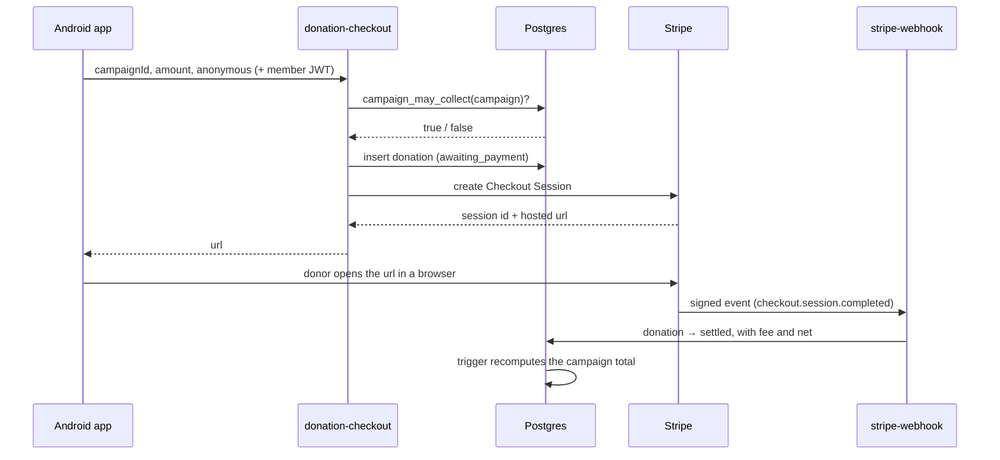

# Payments

*How money moves, what checks it passes on the way, and the four things an operator must
do by hand before a single donation can be taken.*

Read [`payment-compliance.md`](payment-compliance.md) alongside this. That document is the
list of obligations; this one is the mechanism. Neither substitutes for the other, and
having built the mechanism does not discharge the obligations.

---

## The shape of it

Three properties fall out of that diagram, and they are the whole design:

**The app never talks to Stripe.** It receives a URL and opens it. There is no Stripe key,
no Stripe host and no Stripe request anywhere in the client — `SupabaseCheckoutGatewayTest`
asserts that no secret-shaped value ever reaches the wire.

**Card details never reach this platform.** Payment happens on Stripe's own hosted page, in
the donor's browser. That is a deliberate choice over the in-app payment sheet: it keeps
PCI scope at SAQ A, and it lets the donor see the address bar and the padlock, which is
exactly what a web view takes away and exactly what a counterfeit giving flow imitates.

**Nothing but a signed webhook can say money arrived.** No client session can write to
`donations` at all. `DonateUseCase` in the Kotlin core can only ever produce an
`AWAITING_PAYMENT` record, and it has no method that produces any other state.

---

## What a client is trusted with

Two values: a campaign id, and an amount. That is the entire attack surface.

Everything else is derived away from the device:

| Decided by | Value |
| --- | --- |
| The campaign row | currency, receiving organisation, title on the receipt |
| The verified JWT | who the donor is |
| `campaign_may_collect()` | whether this appeal may take money at all |
| Stripe's signed event | whether payment happened, the fee, the net |

`DonateUseCase.Command` deliberately has no currency field. If it had one, somebody could
offer £5 and be charged five of something dearer.

---

## `campaign_may_collect()`

Every condition for taking money, in one function, evaluated **at the moment of giving**
rather than remembered from when the campaign was approved:

- the campaign is `active` and not soft-deleted;
- `payments_enabled` is true on it;
- the receiving organisation holds a verification that has neither expired nor been
  revoked;
- the campaign itself has a verified `financial_review` that has neither expired nor been
  revoked.

The last two are separate on purpose. A trustworthy charity can still run an appeal whose
money has nowhere ring-fenced to land, and a well-run appeal can belong to an organisation
whose registration lapsed last month. Both failures have to be caught, and only one of them
is caught by checking the organisation.

Evaluating at give-time rather than at enable-time is what makes expiry work. A campaign
switched on in March by an organisation whose registration lapsed in June stops collecting
in June, without anyone remembering to revisit it.

---

## Who may switch a campaign on

Only a platform administrator, and only onto a campaign that has passed a financial review.

An organisation administrator can edit their own campaign's title, description and cause
note. They cannot set `payments_enabled` — `trg_campaigns_guard_payments` raises
`insufficient_privilege` if they try, and the RLS assertions in
`backend/supabase/tests/rls_tests.sql` §22 prove it both ways round.

This is enforced three times, deliberately:

| Layer | Mechanism |
| --- | --- |
| Model | `Campaign.init` throws if `paymentsEnabled` is set on an unverified campaign |
| Use case | `EnableCampaignPaymentsUseCase` refuses a non-administrator, and requires a written reason for the audit log |
| Database | `trg_campaigns_guard_payments`, which is the one that actually holds |

---

## Idempotency

Stripe delivers at least once, retries on any non-2xx response, and can deliver out of
order. All three are normal traffic rather than errors.

`payment_events` is keyed on Stripe's own event id, and the insert *is* the lock: if it
conflicts, this event has already been handled and the handler returns 200 without doing
anything. `donations.provider_session_id` carries a unique index for the same reason at the
row level — one checkout session can settle exactly one donation.

One subtlety worth keeping: if the settlement update fails after the ledger row is written,
the handler **deletes the ledger row** before returning 500. Otherwise the lock we just took
would swallow the retry that could have fixed it.

The webhook answers 200 to events it ignores. A non-2xx tells Stripe to retry, and
returning one for an event we do not care about turns a shrug into an infinite retry loop.

---

## What is stored about a payment

Two opaque Stripe identifiers, the fee, the net, and a receipt URL.

No card number. No last four digits. No expiry. No cardholder name. No billing address. The
donor typed all of that on Stripe's page, and none of it reached this application.

`payment_events` deliberately does **not** store the raw event body. A Stripe event carries
the donor's email, billing name and address; keeping every one of them forever would build a
second copy of exactly the personal data this platform is careful about, in a table nobody
thinks of as personal.

---

## What the donor is told

- **The fee is disclosed before the amount field**, not after the button. A donor who
  believes every penny arrives has been misled by omission, and the omission is the easy
  thing to ship. `DonationFeatureFlags.feeNotice` is the copy, and `ProductPrincipleTest`
  fails if it stops mentioning that there is no platform fee — so introducing one forces the
  copy to change with it.
- **`netAmount` is null until settlement, and is shown as "Not known yet".** Never
  estimated, never rounded, never quietly displayed as the gross.
- **Abandoned attempts appear in the donor's own record**, marked "started and not
  finished. Nothing has been charged." A list that silently drops them looks tidier and
  hides the one case that matters: somebody who believes they gave and did not.
- **Quiet giving is the default.** The anonymity choice defaults to anonymous, and an
  anonymous donation's donor is hidden from the receiving organisation by RLS, not by the
  UI.

---

## Limits

| | |
| --- | --- |
| Minimum | £1.00 |
| Maximum | £5,000 |

The floor exists because a fixed processing fee makes a very small donation cost more to
collect than it delivers. The ceiling exists because large amounts carry anti-money-
laundering obligations this platform has not built; the refusal points the donor at the
organisation directly, which is a slower path with a human in it.

Both limits are enforced twice — in `GivingLimits` for the donor's benefit, and again in
`donation-checkout` for everybody who skips the app. **If the two ever disagree, the edge
function wins**, and that is the right way round.

---

## Recurring giving is still off

`DonationFeatureFlags.recurringEnabled` is false and `Campaign.init` throws if
`allowsRecurring` is set. This is not laziness about wiring a subscription. A standing
mandate needs strong customer authentication handled when the mandate is created rather than
at each charge, a cancellation route the donor can find without asking anyone, and a
position on what happens to a monthly gift when the campaign it was for closes. None of
those exist.

---

## Before a donation can actually be taken

Four things, none of which can be done from inside this repository, because each involves a
secret or a decision that is not the code's to make.

1. **Set the function secrets.** Four values, in the Supabase dashboard or via
   `supabase secrets set`:

   | Name | What |
   | --- | --- |
   | `STRIPE_SECRET_KEY` | `sk_live_…` or `sk_test_…` |
   | `STRIPE_WEBHOOK_SECRET` | `whsec_…`, shown once when the endpoint is created |
   | `DONATION_RETURN_URL` | where Stripe returns the donor afterwards |
   | `SUPABASE_ANON_KEY` | already present on most projects |

   Until they are set, `donation-checkout` returns 503 "Giving is temporarily unavailable"
   and no donation can be created. That is the intended unconfigured state.

2. **Create the webhook endpoint in Stripe**, pointed at
   `https://<project>.supabase.co/functions/v1/stripe-webhook`, subscribed to
   `checkout.session.completed`, `checkout.session.expired`,
   `payment_intent.payment_failed`, `charge.refunded` and `charge.dispute.created`. Copy the
   signing secret into `STRIPE_WEBHOOK_SECRET`.

3. **Verify an organisation and a campaign.** `campaign_may_collect()` returns false for
   every campaign until an `organization_verifications` row and a `financial_review`
   campaign verification both exist and are current. This is the check that is supposed to
   be slow.

4. **Answer the compliance questions in [`payment-compliance.md`](payment-compliance.md).**
   Charitable-solicitation registration, tax treatment per fund type, KYB on the receiving
   organisation, sanctions screening, and a published refund policy. The code enforces that
   somebody has verified a campaign. It cannot enforce that the verification meant anything.

---

## Testing

| Suite | What it covers |
| --- | --- |
| `GivingTest` (`:core:data`, 13 tests) | The whole flow through the real use cases: unverified campaigns, lapsed organisation verification, the floor and the ceiling, currency derivation, that starting is never settling, and that only an administrator can switch a campaign on |
| `SupabaseCheckoutGatewayTest` (`:core:payments`, 9 tests) | That no secret reaches the wire, that the client sends no currency or donor id, and that a non-https checkout URL is refused |
| `rls_tests.sql` §21–23 | That no client session can insert, update or delete a donation; that the event ledger is unreadable; that an organisation administrator cannot switch on their own campaign; and that a campaign total counts settled money only, coming back down on a refund |

What none of them cover: **no real payment has been taken.** Nothing in this repository has
reached Stripe. The webhook signature check has never verified a genuine Stripe signature,
only the algorithm it implements. Take a test-mode donation end to end before trusting any
of the above with live keys.
