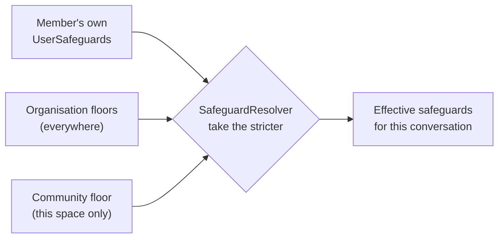
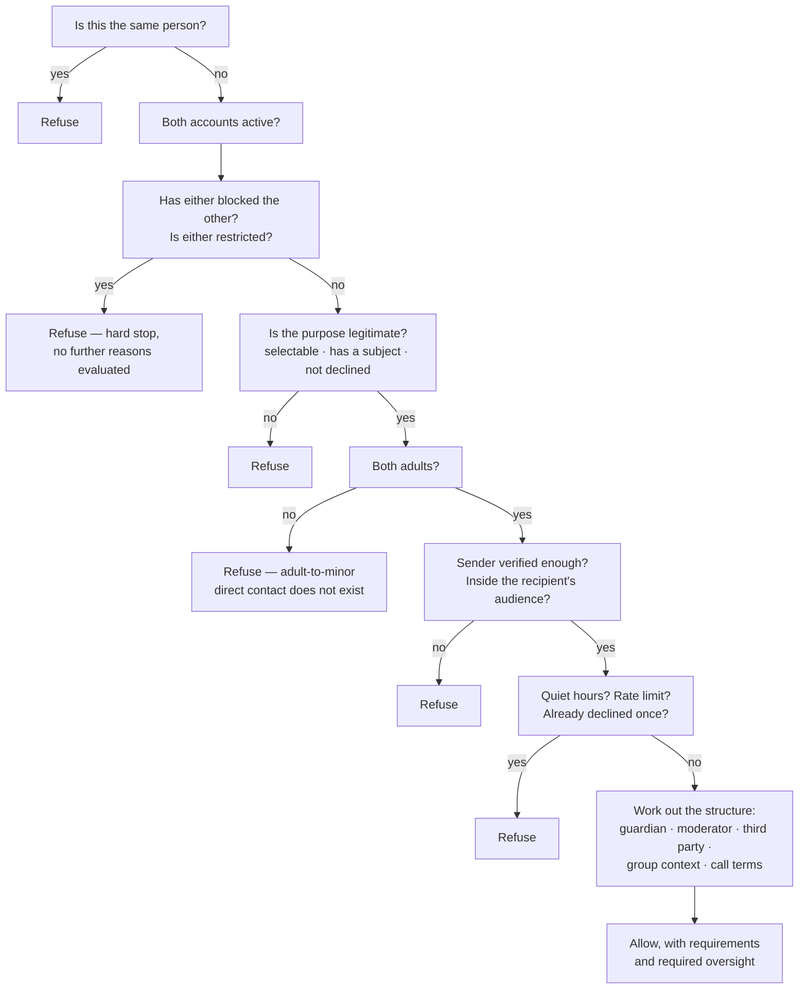

# Safeguards

*Written for two readers: an engineer who has never seen this codebase, and a community
safeguarding lead who does not write software. No part of this document requires you to read
code.*

---

## The idea in one page

Every member of Fi Sabilillah chooses how they may be reached. Those choices are called
their **safeguards**. They cover who can find them, who can start a conversation with them,
what shape a conversation with someone of the opposite gender has to take, whether calls are
possible, whether meetings must be in public, and whether they are open to a marriage
introduction at all.

A masjid, a charity, or a community group can add requirements of its own — for example,
that any conversation between a brother and a sister inside its space has a moderator
present. These are called **floors**.

The single rule that governs the whole system:

> **Combining a member's own settings with an organisation's or a community's floor can only
> ever make things stricter. It can never make anything more open.**

A masjid may require oversight on cross-gender threads. It can never switch a sister's video
calls back on, lower the verification level she requires of people who contact her, or make
her discoverable when she chose not to be. Not through the interface, not through an
administrator, not through a support request. The code that combines the two settings takes
the stricter of each pair and has no branch that does anything else.

For an engineer: `SafeguardResolver.effective(user, floors)` in
`core/policy/src/main/kotlin/org/fisabilillah/core/policy/SafeguardResolver.kt`.

---

## The building blocks

### `UserSafeguards` — a member's own choices

One record per member, created during onboarding before the account can be contacted by
anybody. `CompleteOnboardingUseCase` records consent, saves the profile, and saves the
safeguards in that order, and until it has run the account is in `PENDING_ONBOARDING`, which
the contact gate treats as inactive. Nobody can be reached before they have decided how they
wish to be reached.

Grouped by what they control:

| Group | Settings |
| --- | --- |
| **Discovery** | Who can find your profile; whether your real name is shown and to whom; how precisely your location is shown; whether you have an image at all and who may see it |
| **Being contacted** | Who may start a conversation; the minimum verification level they must hold; whether only people in your organisations may reach you; whether a written explanation is required; which kinds of request you simply do not accept |
| **Cross-gender contact** | The structure a conversation with the opposite gender must take; whether a moderator must be present; whether it must happen inside a group; whether a third party must be present; which purposes automatically copy in your wali |
| **Calls and meetings** | Who may voice call you; who may video call you; who may arrange a one-to-one meeting; whether meetings must be in public places |
| **Lifecycle** | Whether threads archive themselves once the work is done, and after how long |
| **Introductions** | Whether you accept formal family introductions at all, and whether they go to your guardian before you see them |
| **Time of day** | Quiet hours, during which no new conversation may be opened with you |

Two defaults are worth naming because they are unusual. `requireWrittenPurposeStatement` is
**on** by default: attaching a purpose is never optional on this platform, and this setting
only controls whether the sender must also explain themselves in prose.
`acceptFormalIntroductions` is **off** by default, so a member has to make a deliberate
decision before the marriage workflow can reach them at all.

### `AudienceScope` — the "who may…" answer

Every question of the form *who may do this to me* is answered with the same six values,
ordered from most open to most closed:

| Value | Shown as | Strictness |
| --- | --- | --- |
| `EVERYONE` | Anyone on the platform | 0 |
| `VERIFIED_ONLY` | Verified members only | 1 |
| `MY_ORGANIZATIONS_ONLY` | People in my masjid or organisations | 2 |
| `SAME_GENDER_ONLY` | Same gender only | 3 |
| `SAME_GENDER_VERIFIED_ONLY` | Verified members of the same gender | 4 |
| `NOBODY` | No one | 5 |

The ordering is the mechanism. Because each value carries a number, two settings can be
combined by taking whichever has the higher number, and the result is always at least as
strict as both. The same pattern is used for location precision, name visibility, moderator
presence, and the structure of cross-gender conversations — five ordered scales, one rule.

Note that "verified" here means **identity verified**, not email verified. An email address
is not an identity, and `ContactPolicy` uses `VerificationLevel.IDENTITY_VERIFIED` as the bar
wherever a scope says "verified only".

### `SafeguardFloor` — what an organisation or community may add

A floor is a partial set of the same settings. Every field is optional; an unset field means
"we have no opinion about this". Applied to a member's settings, each set field is combined
by taking the stricter of the two.

What a floor **can** require:

- A narrower audience for who may contact its members
- A higher minimum verification level
- More structure on cross-gender conversations
- A moderator present
- A group context
- A third party present
- Narrower audiences for voice calls, video calls, and one-to-one meetings
- That meetings happen in public places
- That formal introductions are not conducted in its space at all

What a floor **cannot** do, because `SafeguardResolver` does not read these fields at all:

- Change who can discover a member's profile
- Change how a member's real name is shown
- Change how precisely a member's location is shown
- Change who can see a member's profile image
- Remove a purpose from a member's declined list
- Switch off a member's quiet hours

The distinction is deliberate. A masjid has a legitimate interest in how people conduct
themselves in its space. It has no legitimate interest in how visible a member is to the rest
of the world.

> **A note on how background checks are actually enforced.** They are not a `SafeguardFloor`
> field. Enforcement runs through two places: `minimumVerificationToContact =
> BACKGROUND_CHECKED` on a community floor, which stops an unchecked member from opening a
> conversation about that community's work; and
> `ServiceCategory.requiresBackgroundCheckByDefault` in `ApplyToOpportunityUseCase` and
> `CreateOpportunityUseCase`, which stops them applying or an organiser publishing without
> it. An earlier draft carried a `requireBackgroundCheckForMinorContact` flag on
> `SafeguardFloor` that no policy read; it was removed rather than left in place, because a
> field that looks like a safeguard and enforces nothing misleads the next reviewer. See
> [`child-safety.md`](child-safety.md).

---

## Organisation floors travel; community floors do not

This is the part that is easy to get wrong, and the code says why in a comment
(`ContactContextAssembler.contextualFloorsFor`).

**An organisation floor applies to its members everywhere on the platform.** Affiliation is
not situational. If Northfield Masjid requires a moderator on cross-gender threads, that
requirement holds for its members whatever they are talking about and to whom.

**A community floor applies only inside that community's space.** The conversation's subject
determines which space it is in: a listing published by a masjid puts the conversation inside
that masjid, a project attached to a community puts it inside that community, and a bare
organisation enquiry names the organisation directly.

The reason is a concrete failure the design exists to avoid.

> The Northfield Youth Programme rightly demands that anyone talking to it holds a current
> background check. That is the strictest floor in the seeded data and deliberately so.
>
> If that floor applied to every conversation its volunteers had, a brother who helps with
> Saturday football could no longer be asked about a house move — by anyone, ever, until they
> completed a criminal-record check. That is not what the programme asked for, and it is not
> something the programme has any business deciding.

Two tests pin this down, in `core/data/src/test/.../PlatformBehaviourTest.kt`: *"a community
floor applies inside that community's space"* and *"a community floor does not follow its
volunteers into unrelated conversations"* — the same two accounts, the same day, one refused
and one allowed, distinguished only by what the conversation is about.

The result of that combination is itself a `UserSafeguards` record. The rest of the system
never needs to know whether a restriction came from the person or from their masjid — only
what the restriction is.

---

## The presets

A blank grid of thirty switches is not a real choice for anybody, so onboarding offers five
named starting points plus a custom option. They are defined in `SafeguardPresets`.

**No preset is more religious than another.** The source file says so in a comment, a test
asserts it (`"no preset is presented as more religious than another"`), and the interface
must never sort, badge, rank, or compare them. Someone on *Community service only* is not
less careful than someone on *Maximum privacy*. A revert who is the only Muslim in their town
and a sister living with her family have different needs, and neither is a measure of the
other's religion.

Presented in the order onboarding shows them.

### Community service only — the default

*"Open to service, learning and project requests. Marriage enquiries are off."*

| Setting | Value |
| --- | --- |
| Discoverable by | Anyone on the platform |
| Real name | Display name only |
| Location shown as | City |
| Image | Initials, visible to same gender |
| Contactable by | Verified members only |
| Minimum verification to contact | Email verified |
| Cross-gender conversations | Direct, with a stated purpose |
| Voice calls / video calls / one-to-one meetings | Same gender / nobody / same gender |
| Meetings in public places | Required |
| Formal introductions | Off |

### Learning only

*"You can be reached about teaching and study. Everything else is closed."*

Identical to the above except: discoverable by verified members only, and the purposes
*volunteering*, *assistance request* and *community project* are declined outright — a
request of those kinds is refused before it reaches the recipient.

### Family and wali guided

*"Your trusted contact is included in conversations with the opposite gender, and any
marriage enquiry goes to them first."*

| Setting | Value |
| --- | --- |
| Discoverable by | Verified members only |
| Real name | Only to organisers I commit to |
| Location shown as | City |
| Image | Initials, visible to same gender |
| Contactable by | Verified members only |
| Minimum verification to contact | Phone verified |
| Cross-gender conversations | **My wali or trusted contact must be in the conversation** |
| Guardian copied on | **Every purpose** |
| Voice calls / video calls / one-to-one meetings | Same gender / nobody / same gender |
| Meetings in public places | Required |
| Formal introductions | **On**, going directly to the guardian |

This is the only preset that switches introductions on, and it does so with
`introductionsGoDirectlyToGuardian` set, meaning the member never sees a request before her
wali does.

### Organisation managed

*"Only people in your masjid or organisations can find or contact you, and your
organisation's rules apply on top of yours."*

| Setting | Value |
| --- | --- |
| Discoverable by | People in my organisations |
| Contactable by | People in my organisations, and only those |
| Minimum verification to contact | Email verified |
| Cross-gender conversations | Only inside a group or project thread |
| Moderator presence | For conversations with the opposite gender |
| Image | Initials, visible to my organisations |
| Voice calls / video calls / one-to-one meetings | My organisations / nobody / same gender |
| Meetings in public places | Required |
| Formal introductions | Off |

### Maximum privacy

*"You are not discoverable, no one can start a conversation with you, and you reach out only
when you choose to."*

| Setting | Value |
| --- | --- |
| Discoverable by | No one |
| Real name | Display name only |
| Location shown as | Region |
| Image | None, visible to no one |
| Contactable by | **No one** |
| Minimum verification to contact | Identity verified |
| Cross-gender conversations | Guardian present |
| Moderator presence | For conversations with the opposite gender |
| Group context | Required |
| Voice calls / video calls / one-to-one meetings | Nobody / nobody / nobody |
| Meetings | Public places, third party present |
| Formal introductions | Off |
| Quiet hours | On |

A member on this preset is invisible and unreachable. They can still find people and start
conversations themselves; nobody can start one with them.

### Custom

Starts from *Community service only* and is labelled as the member's own. Choosing any
individual switch moves a member here.

---

## Changing your settings

Tightening always succeeds and needs no explanation. Loosening also succeeds — it is the
member's own account — but `UpdateSafeguardsUseCase` returns a plain-language list of exactly
what is being opened up, and the interface is expected to show it **before** the change is
confirmed rather than afterwards. `SafeguardResolver.loosenedFields` produces sentences like
"More people will be able to start a conversation with you" and "You will start receiving
formal family introductions".

Every change writes an audit entry, and a loosening change records which fields were
loosened. This is not surveillance of the member; it is so that if an account is compromised
and its safeguards quietly widened, there is a record of when it happened.

---

## The contact gate

One function decides whether a conversation may be opened: `ContactPolicy.evaluate` in
`core/policy/src/main/kotlin/org/fisabilillah/core/policy/ContactPolicy.kt`. It is written as
one long ordered sequence rather than as clever composition, because a reviewer needs to be
able to read it top to bottom and satisfy themselves that nothing was missed. It performs no
input or output of any kind, which is what makes it exhaustively testable.

Everything about the platform's resistance to becoming a place for private pursuit rests on
this function and on the fact that no other code path creates a conversation.

### The order, and why it is that order

1. **Self-contact.** Returns immediately.
2. **Account state.** Either account being inactive, suspended, banned or pending deletion.
3. **Blocks,** in both directions.
4. **Restrictions** imposed by the safety team.
5. → **Hard stop.** If anything so far produced a denial, the function returns *here*, before
   any of the checks below run. This is not an optimisation. It means that once somebody has
   blocked you, no refusal message can be used to probe their settings.
6. **The purpose itself.** A marriage enquiry is refused outright with a message pointing at
   the guardian-led process; a moderation thread can only be opened by the safety team; a
   purpose that requires a subject must have one; a purpose the recipient has declined is
   refused.
7. **Age.** If one party is an adult and the other is not, contact is refused. There is no
   configuration that permits it.
8. **Verification floor.**
9. **Audience scope** — the recipient's `contactableBy`, plus the organisations-only switch.
10. **Quiet hours,** computed in the recipient's local time and correctly handling a window
    that wraps past midnight.
11. **Rate limits.** Ten new conversations per rolling twenty-four hours. And crucially: a
    single prior decline from this recipient refuses further contact outright
    (`MAX_APPROACHES_AFTER_DECLINE = 0`).
12. **Structure.** Everything from here produces *requirements* rather than refusals: which
    people must be in the thread, whether it must live inside a group, whether calls are
    switched off, whether meetings must be public.

Requirements are not advice. `StartConversationUseCase` adds the required oversight
participants as members of the conversation at creation, before the first message is
readable, and posts a system message naming the terms so that everybody present — including
a guardian who was added without being asked — can see why they are there. There is no
corresponding remove: a person who can be removed from a thread by the person they are
supervising is not oversight.

### The four shapes of cross-gender contact

| Structure | What it means |
| --- | --- |
| Direct, with a stated purpose | A one-to-one thread, still purpose-bound and still logged |
| Only inside a group or project thread | Must happen inside a shared community; refused if there is not one |
| A third party must be present | Someone of the recipient's choosing joins the thread on creation |
| My wali or trusted contact must be present | The recipient's guardian joins the thread on creation |

If a member requires a guardian and no guardian is available, contact is **refused** rather
than quietly downgraded. A guardian is "available" only if they have a linked account: a name
and a phone number in someone's settings is not a participant, and treating it as one would
mean telling a member their wali was present when nobody was reading the thread.

---

## Why refusal messages are vaguer than the audit record

Each `DenialReason` carries two strings: a `userFacingMessage` shown to the sender, and an
`auditReason` written to the record. They differ on purpose.

| Situation | The sender is told | The record says |
| --- | --- | --- |
| The recipient has blocked them | "This member cannot be contacted." | recipient has blocked the initiator |
| The recipient's account is inactive | "This member cannot be contacted." | recipient account is not active |
| The recipient is restricted | "This member cannot be contacted." | an active restriction removes the recipient's ability to receive messages |
| The recipient does not accept cross-gender contact | "This member is not accepting new conversations." | recipient's settings do not permit contact from the opposite gender |
| The recipient's `contactableBy` excludes them | "This member is not accepting new conversations." | recipient's contactable-by scope excludes the initiator |

Four separate situations, two messages. "She has blocked you" and "she only accepts messages
from verified members" tell a determined person very different amounts about how to get
through, and a person who can tell the difference can work out which door to try next.

The exception proves the rule. Where a refusal is **actionable by the sender about
themselves** the message is specific: "This member only accepts messages from members who
have verified more of their account. You can raise your verification level in Settings." That
tells the sender about their own account, not about the recipient's settings.

Every refused attempt is written to the audit log with the precise reason, so a pattern of
refused approaches to the same person is visible to the safety team even though the recipient
never saw a single one of them.

---

## What a safeguarding lead should take from this

- **A member's boundaries cannot be widened by anyone but the member.** Not by an
  organisation, not by an administrator, not by support.
- **An organisation can require more, and only more.** If your masjid wants a moderator in
  every cross-gender thread in its space, set that floor and it will be enforced without any
  member having to opt in.
- **A guardian requirement is real.** The guardian is a member of the thread from the first
  message, is announced in it, and cannot be removed by the person who opened it.
- **Silence and refusal are protected.** One decline from a recipient ends the matter; a
  further approach is refused by the platform rather than left to the recipient to fend off.
- **Refusals are deliberately uninformative to the sender** and precise in the record. If you
  are investigating harassment, the record is where the detail is.
- **Presets are circumstances, not rankings.** If you find yourself describing a member as
  "on the strict setting" as though it says something about their religion, the product has
  failed at something it tried hard to prevent.

---

## Related

- [`wali-workflow.md`](wali-workflow.md) — the guardian-led introduction process
- [`privacy-model.md`](privacy-model.md) — what is collected, and the exact-address rule
- [`child-safety.md`](child-safety.md) — the adults-only position and background checks
- [`moderation-guide.md`](moderation-guide.md) — what happens when a safeguard is circumvented
- [`backend/docs/rls-model.md`](../backend/docs/rls-model.md) — how the database enforces the
  same rules a second time, independently
