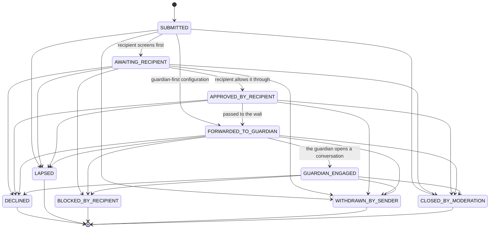
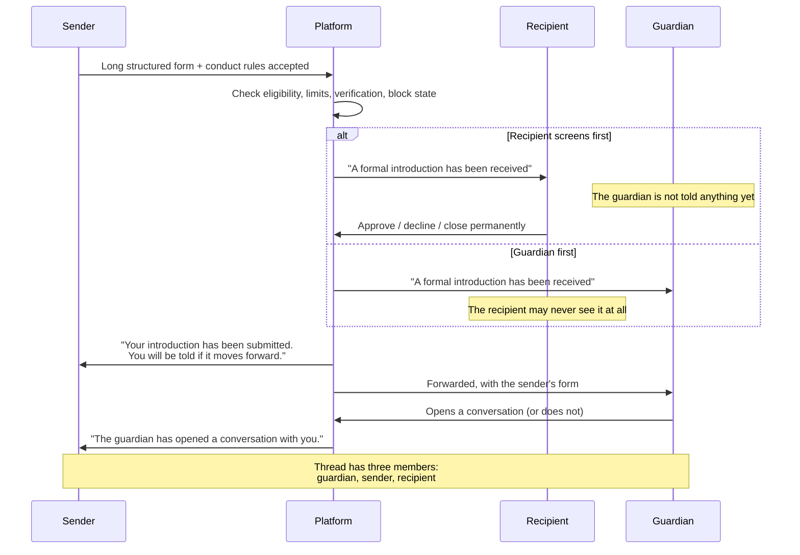

# The Formal Family Introduction workflow

*Written for two readers: an engineer, and a community safeguarding lead who does not write
software. Nothing here requires you to read code.*

---

## The platform issues no rulings

Before anything else, verbatim from the source
(`IntroductionPolicy.RELIGIOUS_GUIDANCE_NOTICE`), shown wherever this feature appears:

> "This platform does not give religious rulings. Arrangements around a wali, an
> intermediary, and marriage differ by school and by circumstance — please ask a qualified
> scholar who knows your situation."

The workflow lets a member nominate a wali, and — if their circumstances call for it and they
choose to allow it — an imam or another trusted intermediary in place of one. Whether that is
correct for a particular person is a question for someone qualified who knows them. The app
records the arrangement; it does not adjudicate it.

---

## What this is, and what it is not

It is a way for one person to make a serious, structured expression of interest in marriage,
which is received by the other person's guardian rather than by them, and which can only ever
lead to a conversation that the guardian is part of.

What it is **not**, and could not become without someone deliberately writing new code:

| Not this | Why it is impossible here |
| --- | --- |
| **Browsing** | There is no list, no feed, no directory, and no search filter for members who accept introductions. `PeopleSearchCriteria` has no such field. |
| **Swiping** | There is one entry point: a long structured form, completed once, per recipient, ever. |
| **A searchable marketplace** | Whether a member has the feature on is not visible, not filterable, and not inferable from any refusal message. |
| **A visible outcome** | Nobody is ever told that a member declined, accepted, or is considering anybody. |
| **A ranking** | There is no score, no ordering, no "popular" state, and nothing to sort by. |
| **A read receipt** | A sender cannot tell whether their request was opened, or by whom, or whether the recipient even has the feature switched on. |
| **A second chance** | `MAX_PER_RECIPIENT_EVER = 1`. |
| **A private chat** | The only conversation this workflow produces has three people in it, always. |

The whole design rests on the shape of the thing rather than on any single check. There is no
path anywhere in `IntroductionPolicy` from "interested" to "private conversation". The only
exit into a conversation runs through a guardian.

---

## Switched off by default

`FormalIntroductionSettings.enabled` starts `false`. Of the five safeguard presets, only
*Family and wali guided* turns it on. A member who never opens the setting is simply not part
of this feature, and nobody can tell.

Turning it on requires a nominated guardian first. `UpdateIntroductionSettingsUseCase`
refuses to save an enabled configuration without one:

> "Add a wali or trusted intermediary before switching formal introductions on. Introductions
> are always received by them."

The reason is stated in the model itself: a request forwarded to nobody is exactly the
failure mode this whole design exists to prevent. The check is made in three places — the
model's `isUsable` property, the policy, and the use case.

A member also chooses:

| Setting | Effect |
| --- | --- |
| **Who reviews first** | Whether they see a request before their guardian does, or whether everything goes straight to their wali. Both are legitimate arrangements and the product takes no view. |
| **Whether the guardian stays in every exchange** | Regardless of this, the introduction thread itself is always guardian-inclusive. This is a floor. |
| **Whether an intermediary may act in place of a wali** | Off by default. |
| **Who may submit at all** | An audience scope, defaulting to verified members only, plus a minimum verification level defaulting to identity verified, plus an optional requirement of a shared organisation. |
| **How many open requests at once** | Between one and ten, defaulting to three. |
| **Intentions statement and compatibility notes** | Non-sensitive information shared only once a request is accepted. Compatibility notes attach to a fixed set of topics — practice and priorities, education, work, languages at home, where they intend to live, family expectations, timeline — and are capped at 300 characters each. Deliberately not free-form about a person. |

---

## The form a sender completes

Five long-form fields, each requiring at least 40 characters and capped at 1,500:

- Your intention
- About yourself
- Your family context
- Practice and priorities
- Living situation and plans

Plus the name and relationship of the guardian or representative who will act for the sender,
up to ten questions for the family, and two explicit confirmations.

The length floor is not bureaucracy. It is long enough to be a deterrent to anyone who is not
serious, and structured enough that a guardian receives something they can actually evaluate.
The validation message says so: *"This goes to a family, so please write it properly."*

Validation lives in `IntroductionPolicy.validateForm` rather than in the type's constructor,
so that a screen can show field-addressed errors inline. The model carries a comment
explaining the choice: constructing an incomplete form is expected; submitting one is not.

### The conduct rules

Six statements the sender must accept, recorded against their account with a timestamp so
they cannot later claim they were not told (`IntroductionForm.CONDUCT_RULES`):

1. This is a request for marriage consideration. It is not a way to start a casual
   conversation.
2. I will not attempt to contact this person privately, on this platform or elsewhere,
   outside the process they have chosen.
3. I accept that a guardian or trusted representative may be present in every exchange.
4. I accept that no reply is itself an answer, and I will not send a second request or
   approach them through anyone else.
5. I will not share anything from this process with anyone outside it.
6. I understand the platform makes no religious ruling about my circumstances, and that I
   should consult a qualified scholar who knows my situation.

Breaking the second or fourth of these is a reportable category in its own right:
`ReportCategory.WALI_PROCESS_CIRCUMVENTION`, "Going around the guardian process", severity
high.

---

## The state machine

Every permitted transition, exactly as `IntroductionPolicy.allowedTransitions` defines them.
Anything not drawn here simply cannot happen — `canTransition` is consulted before any status
change, and an attempt to make an undrawn move is refused as "That is not a valid step for
this introduction."

Read the forward path first — it is three arrows long, and it is the only one:

**`FORWARDED_TO_GUARDIAN` → the guardian opening it → `GUARDIAN_ENGAGED`.**

There is no transition from `SUBMITTED` to a conversation, none from `AWAITING_RECIPIENT`,
and none from `APPROVED_BY_RECIPIENT`. A test asserts this by name: *"there is no transition
from submitted straight to a conversation."*

Two notes for engineers. `APPROVED_BY_RECIPIENT` is transient in practice —
`DecideIntroductionUseCase` checks the transition into it and then immediately moves to
`FORWARDED_TO_GUARDIAN` in the same operation, so it exists as a distinct state for the
machine's sake rather than as something a user will see. And `APPROVED_BY_RECIPIENT` is the
one open state with no arrow to `BLOCKED_BY_RECIPIENT`, which is a consequence of that
transience rather than a considered position; blocking the sender from the ordinary block
control still closes any open introduction, through `BlockUserUseCase`.

The five terminal states are terminal. There is no reopening.

---

## Who sees what, and when

A member whose family arrangement is that everything goes to their wali first is **never
shown the request at all**. That is precisely the arrangement some families want and which no
general-purpose messaging product can offer.

A test pins this down end to end: with the recipient screening first, the request stops at
`AWAITING_RECIPIENT` and the assertion is that the guardian received *no notification*.
Flipped to guardian-first, an identical submission lands at `FORWARDED_TO_GUARDIAN` and the
guardian is notified.

---

## The guardian's contact details never leave their owner

This is the single most sensitive thing the platform holds, and the design treats it that
way.

A `TrustedContact` record has a `privateContact` field holding an email address, a phone
number, and any private note the owner wrote for themselves. That field exists as its own
named type — `PrivateContactDetails` — for a stated reason: so that a reviewer can search the
codebase for it and find every place guardian contact information is handled.

Nothing crosses the boundary to a counterparty except `TrustedContact.redacted()`, which
produces a `RedactedTrustedContact` carrying only:

- the guardian's name
- their stated relationship
- their role (wali or intermediary)
- how they prefer to be approached
- whether they have confirmed the role

A counterparty in an introduction learns that a guardian exists and how they prefer to be
approached. Nothing more. When an introduction is approved and forwarded, **the platform
contacts the guardian; it does not hand out their number.**

`ViewIntroductionGuardianUseCase` is the only route by which any of this leaves the domain
layer. It refuses unless the caller is a participant in that introduction, refuses unless the
introduction has actually reached the guardian, and writes a `GUARDIAN_CONTACT_ACCESSED`
audit entry every time it succeeds. Its own comment makes the argument: if this function is
the only way guardian information leaves the domain layer — and it is — then a leak requires
somebody to write a new one, which is a reviewable act rather than an accident.

Before forwarding, the sender is not even told that a guardian exists. The use case returns
"not found", not "not yet".

A test asserts all of it: the redacted result is serialised and checked to contain no email
fragment, no phone fragment, and none of the owner's private note.

In the database, the same rule is enforced independently. SELECT on
`wali_profiles.contact_email` and `.contact_phone` is revoked from every application role —
moderators included — and disclosure happens only through `app.get_wali_contact()`, only
after the introduction has been forwarded, only to an authorised participant, and is written
to an append-only ledger. See [`backend/docs/rls-model.md`](../backend/docs/rls-model.md)
§"The wali contact rule".

---

## The conversation always has three people in it

`IntroductionPolicy.conversationEligibility` returns `guardianRequired = true`
unconditionally. Both of its success branches return the same thing, and the code says why:
even when the recipient has not asked for the guardian to be in every message, the
introduction thread itself is guardian-inclusive. **This is the floor.**

`OpenIntroductionConversationUseCase`:

- refuses anyone who is not the guardian — "Only the guardian can open this conversation"
- refuses if the guardian has no account on the platform, and says so plainly rather than
  proceeding without them
- constructs the thread with three members: the guardian, the sender, and the recipient
- attaches the terms permanently: guardian present, written purpose required, **no voice
  calls, no video calls, public meetings only**
- posts a system message stating that the guardian is a member and will remain so, ending
  with the religious-guidance notice

A test proves both the sender and the recipient are refused when they try to open it, that
the guardian succeeds, and that the resulting thread has exactly three members.

A recipient who wants to speak without their wali present is not using this feature. They are
outside it, and the platform does not provide a route there.

---

## Silence is a complete answer

An unanswered introduction lapses on its own after **21 days**
(`IntroductionLimits.LAPSE_AFTER_DAYS`). Nobody has to decline. Nobody has to explain. The
status becomes `LAPSED` with the closure reason "No response within the window", and the
sender is told the process has concluded — with no indication of whether anyone read it.

This is the fourth conduct rule made real: *"I accept that no reply is itself an answer."*

---

## Limits that apply regardless of anyone's settings

Someone sending the same structured form to thirty people is not being serious, and no
per-recipient setting can catch that on its own.

| Limit | Value | What it prevents |
| --- | --- | --- |
| Open requests at once | 2 | Running several in parallel |
| Requests in a rolling 30 days | 4 | Volume across many recipients |
| Requests to the same person, ever | 1 | Persistence after silence or refusal |
| Days before an unanswered request lapses | 21 | An open request hanging over someone indefinitely |

Plus the recipient's own ceiling on how many open requests they will hold at once, defaulting
to three.

---

## Identical refusals, so a sender learns nothing

Every reason a submission can be refused *about the recipient* produces the same sentence:

> **"This member is not receiving formal introductions."**

That covers: the feature being switched off, no guardian configured, an ineligible guardian,
the recipient having blocked the sender, the sender having blocked the recipient, the
recipient's account being inactive, the sender falling outside the recipient's chosen
audience, and a missing shared organisation. Eight different situations, one sentence.

The source comment states the reasoning: whether a person has introductions switched off, has
blocked you, or simply does not meet their verification level is none of the sender's
business — and a sender who can tell the difference can work out which door to try next.

A ninth refusal, "This member is not receiving formal introductions at the moment", covers
the recipient being at their own capacity limit. It is deliberately near-identical.

Refusals **about the sender's own account** are specific, because they are actionable:

| Situation | Message |
| --- | --- |
| Not identity verified | "Formal introductions require identity verification. You can complete this in Settings before submitting." |
| Already submitted to this person | "You have already submitted a formal introduction to this member. Please respect their answer." |
| Too many open | "You already have the maximum number of open introductions. Please wait for those to conclude before submitting another." |
| Too many recently | "You have submitted several introductions recently. This process is meant to be considered, not sent in volume." |
| Same gender | "Formal introductions are between a man and a woman." |
| Either party under 18 | "Formal introductions are only available between adults." |

A test asserts the property directly: *"a member with the feature switched off is
indistinguishable from any other refusal."*

---

## What the sender is told about an outcome

Never "she said no". Never a reason. Never the name of whoever decided. Never a count of how
many others are in the queue. A rejection that carries detail invites argument, and a
rejection that is public invites humiliation.

| Status | What the sender sees |
| --- | --- |
| Submitted, with the recipient, approved | "Your introduction has been submitted. You will be told if it moves forward." |
| Forwarded to the guardian | "Your introduction has been passed to the family's guardian." |
| The guardian opened a conversation | "The guardian has opened a conversation with you." |
| Declined, lapsed, or closed permanently | "This introduction has concluded. Please do not submit another or make contact another way." |
| Withdrawn by them | "You withdrew this introduction." |
| Closed by the safety team | "This introduction was closed by the safety team." |

Declined, lapsed and permanently closed all produce the **same** sentence. A sender cannot
distinguish a considered refusal from silence, which is exactly right: both mean no, and
neither is owed an explanation.

A test asserts it: *"a declined sender is told nothing beyond the fact that it ended."*

---

## Closing the door permanently

A recipient can close an introduction permanently rather than merely declining it. Doing so
sets `BLOCKED_BY_RECIPIENT`, records the closure reason, and **creates an ordinary block**
against the sender in the same operation.

The effect is total: no second introduction, and no ordinary conversation either. The block
runs through `ContactPolicy` like any other, and the sender is told only "This member cannot
be contacted."

The reverse also holds. Blocking someone through the ordinary control closes any open
introduction from them permanently, rather than leaving it in a queue where a later change of
settings could quietly revive it.

---

## Marriage enquiries cannot be sent as messages

`ContactPurposeKind.FORMAL_INTRODUCTION` is not user-selectable and is refused outright by
the contact gate before any other check, with a message that points at the right door:

> "Marriage enquiries go through the Formal Family Introduction process, not through
> messages."

The purpose validator catches the other route in. `PurposeValidator` scans the stated reason
and requested action for phrases that suggest the "purpose" is really an opening line — "you
look", "beautiful", "are you single", "just wanted to say hi", "get to know you better",
"whatsapp me", and a couple of dozen others — and refuses with:

> "This does not read like a request for help, teaching, or community work. Conversations
> here need a service purpose. If you are interested in marriage, that is a separate process
> led by a guardian."

A test asserts that message both names a service purpose and points at the guardian-led
route, because refusing without saying where to go teaches nothing.

---

## What a safeguarding lead should take from this

- **A member is unreachable through this feature unless they deliberately switched it on**,
  and nobody can tell whether they have.
- **A guardian's phone number and email address are never disclosed to a counterparty**, in
  any state, at any point.
- **The only conversation this produces has the guardian in it**, from the first message,
  with calls switched off and meetings required to be in public.
- **One request per person, ever.** A second attempt is refused by the platform, not left to
  the recipient to fend off.
- **No answer is an answer**, and it expires on its own after three weeks.
- **A sender cannot learn anything about a recipient from a refusal**, which is what stops
  the feature from becoming a probe.
- **Going around the process is a named reportable offence** with high severity, and includes
  approaching someone through a third party.
- **The platform makes no religious ruling**, and says so wherever the subject arises.

---

## Related

- [`safeguards.md`](safeguards.md) — how boundaries work generally, and the contact gate
- [`moderation-guide.md`](moderation-guide.md) — handling a report of process circumvention
- [`privacy-model.md`](privacy-model.md) — what is retained and for how long
- [`backend/docs/rls-model.md`](../backend/docs/rls-model.md) §"The wali contact rule" — the
  database's independent enforcement
- [`backend/docs/threat-model.md`](../backend/docs/threat-model.md) AP-1 — harvesting wali
  contact details, as an explicit attack path
